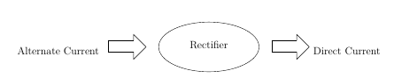
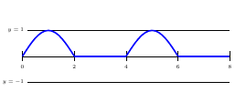

# Theory

### Rectification

Figure 1  

A rectifier is a device that converts alternating current (AC) to direct current (DC), a process known as rectification. Rectifiers are essentially of two types – a half wave rectifier and a full wave rectifier.

### Half Wave Rectification

Figure 2  

On the positive cycle the diode is forward biased and on the negative cycle the diode is reverse biased. By using a diode we have converted an AC source into a pulsating DC source. In summary we have ‘rectified’ the AC signal.

Figure 3  

The simplest kind of rectifier circuit is the half-wave rectifier.The half-wave rectifier is a circuit that allows only part of an input signal to pass. The circuit is simply the combination of a single diode in series with a resistor, where the resistor is acting as a load.

### Half Wave Rectifiers – Waveforms

Figure 4  

Figure 5  

The output DC voltage of a half wave rectifier can be calculated with the following two ideal equations.

$$V_{peak}=V_{rms} \times √2$$
$$V_{dc}=\frac{V_{peak}}{Π}$$

### Half Wave Rectification:For Positive Half Cycle

Figure 6  

Diode is forward biased, acts as a short circuit, passes the waveform through.

For positive half cycle: $$V_I - V_b - I \times r_d - I \times R=0$$ where,
$$V_I$$ is the input voltage,
$$V_b$$ is barrier potential,
$$r_d$$ is diode resistance,
$$I$$ is total current,
$$R$$ is resistance
$$I=\frac{V_I - V_b}{r_d + R}$$
$$V_O = I \times R$$
$$V_O =\frac{V_I - V_b}{r_d + R} \times R$$
For \(r_d\)<< \(R\),
$$V_O = V_I- V_b$$
$$V_b$$ is 0.3 for Germanium ,
$$V_b$$ is 0.7 for Silicon

For $$V_I < V_b$$,

The diode will remain OFF.The Output voltage will be,
$$V_O =0$$
For $$V_I > V_b $$,

The diode will be ON.The Output voltage will be,
$$V_O = V_I- V_b$$

### Half Wave Rectification:For Negative Half Cycle

Figure 7  

Diode is reverse biased, acts as a open circuit, does not pass the waveform through.

For negative half cycle:

$$V_O=0 \quad Since, \quad I =0$$

### Half wave Rectification:For an Ideal Diode

For Ideal Diode,

$$V_b = 0$$

For positive half cycle,

$$V_O = V_I$$

For negative half cycle,

$$V_O = 0$$

### Average output voltage

$$V_O=V_m \times \sin wt \quad for \quad 0 \leq wt \leq \pi$$
$$V_O=0 \quad for \quad \pi \leq wt \leq 2 \pi$$
$$V_{av}=\frac{V_m}{\pi} =0.318V_m$$

RMS load voltage

$$V_{rms}=I_{rms} \times R = \frac {V_m}{2}$$

#### Average load current

$$I_{av}=\frac{V_{av}}{R} =\frac{\frac{V_m}{\pi}}{R}$$
$$I_{av}=\frac{V_{m}}{\pi \times R}=\frac{I_m}{\pi}$$
RMS load current

$$I_{rms}=\frac {I_m}{2}$$

Form factor: It is defined as the ratio of rms load voltage and average load voltage.

$$F.F= \frac{V_{rms}}{V_{av}}$$
$$F.F= \frac{\frac{V_{m}}{2}}{\frac{V_{av}}{2}}=\frac{\pi}{2}=1.57$$
$$F.F \geq 1$$
$$rms \geq av$$

### Ripple Factor

$$\gamma=√({F.F}^2-1) \times 100\%$$
$$\gamma=√({1.57}^2-1) \times 100\%=1.21\%$$

Efficiency:It is defined as ratio of dc power available at the load to the input ac power.

$$n\%=\frac{P_{load}}{P_{in}} \times 100\%$$
$$n\%=\frac{{I_{dc}^2} \times R}{{I_{rms}^2} \times R}\times 100\% $$
$$n\%=\frac{\frac {I_{m}^2}{\pi^2}}{\frac{I_{m}^2}{4}}\times 100\%=\frac{4}{\pi^2}\times 100\% =40.56 \%$$

### Peak Inverse Volatge

For rectifier applications, peak inverse voltage (PIV) or peak reverse voltage (PRV) is the maximum value of reverse voltage which occurs at the peak of the input cycle when the diode is reverse-biased.The portion of the sinusoidal waveform which repeats or duplicates itself is known as the cycle. The part of the cycle above the horizontal axis is called the positive half-cycle, the part of the cycle below the horizontal axis is called the negative half cycle. With reference to the amplitude of the cycle, the peak inverse voltage is specified as the maximum negative value of the sine-wave within a cycle's negative half cycle.

$$ PIV=V$$
$$ -V_m +V=0 \Rightarrow V=V_m$$
$$PIV \geq V_m$$

## Oscilloscope Tutorial

An oscilloscope displays a voltage waveform versus time and has the following components:
1. a screen to display a waveform,
2. input jacks for connecting the signal to be displayed,
3. dials to control how the signal will be displayed.

The screen is cathode ray tube found in most television sets where the face of the screen is divided up into a 2 dimensional grid (or axes or scale); In this experiment we consider 8x10 grid. The vertical grid is divided up into 8 (major) divisions and the horizontal grid is divided into 10 major divisions. To improve the precision, each of these divisions is further broken up into 5 minor divisions. The horizontal axis (X-axis) represents time and the vertical axis (Y-axis) represents voltage. The scope displays (also called a signal trace or trace) the input signal voltage along the vertical (or Y-axis) while an internally generated signal (called the horizontal sweep or sweep signal) is simultaneously produced along the X-axis creating a 2- dimensional time trace of the input signal.

Figure 8  

volts/div- This control lets you change how many volts are represented by each vertical increment of grid (vertical axis) on the screen. Basically, it allows you to zoom in and out along the y axis.

time/div- This control lets you change how much time is represented by each horizontal increment of the grid overlay on the screen. It allows you to zoom in and out along the x axis.

If volt/div is set to 1 volt which implies each mazor vertical division is 1 volt where as each minor vertical division is 0.2 volt. And time/div is set to 0.1ms/div which implies each maor horiontal division is 0.1ms. Voltage on the vertical scale is 1 volt/div multiply by (number of division). Time on the horizontalscale is 0.1msec multiply by (number of division). In the figure 9, 1 volt/div and amplitude of the input signal is 1 volt. Here 0.1mses/div, the frequency is 1 kHz and its period is 1 complete cycle in 1m sec.

Figure 9  

In the figure 10, if volt/div is set to 2volt/div, which implies each mazor division is 2 volt where as each minor division is 0.5volt.

Figure 10  

**Note:** If you set the Volts/Div too low, you’ll clip the signal. Similarly, setting it too high, and you’ll won’t find the signal, i.e. the signal will b flat. ncreasing the Timebase will display more cycles of a periodic signal. Conversely, reducing the Timebase, fewer cycles will be displayed.

Virtual Oscilloscope Tutorial : [Oscilloscope Tutorial](http://vlabs.iitkgp.ac.in/be/exp6/content/Oscilloscope%20Tutorial_halfwave.pdf)

